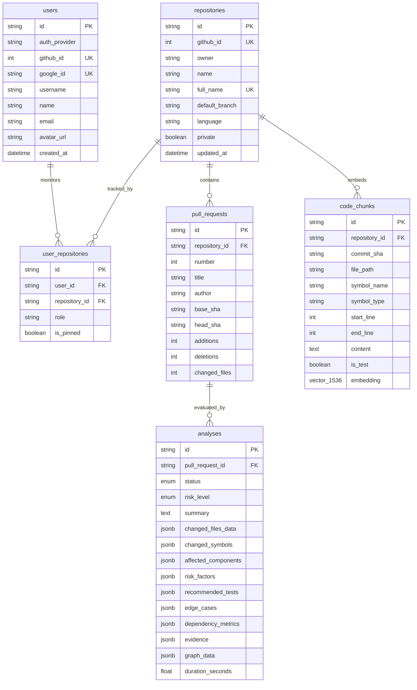

# PRism 🔍

> **Autonomous AI Pull Request Risk Analyzer & Downstream Blast Radius Intelligence Engine**

PRism analyzes GitHub Pull Requests by combining **Tree-sitter AST static analysis**, **directed multi-graph dependency traversal (NetworkX)**, **AST-aware semantic code chunking with pgvector hybrid retrieval**, and **evidence-grounded LLM synthesis** to compute deterministic blast radiuses, risk scores, and missing test recommendations before code is merged.

[](https://python.org)
[](https://fastapi.tiangolo.com)
[](https://nextjs.org)
[](https://reactflow.dev)
[](https://github.com/pgvector/pgvector)
[](https://tree-sitter.github.io)
[](https://networkx.org)
[](LICENSE)

---

## Table of Contents

- [Architectural Overview & Design Flow](#architectural-overview--design-flow)
- [Core Technical Pipeline](#core-technical-pipeline)
  - [1. Unified Diff Parsing & Line-Range Intersection](#1-unified-diff-parsing--line-range-intersection)
  - [2. Multi-Language Tree-sitter AST Ingestion](#2-multi-language-tree-sitter-ast-ingestion)
  - [3. Directed Multi-Graph Dependency Modeling](#3-directed-multi-graph-dependency-modeling)
  - [4. Deterministic Risk Signal Classification](#4-deterministic-risk-signal-classification)
  - [5. AST-Aware Semantic Chunking & pgvector RAG](#5-ast-aware-semantic-chunking--pgvector-rag)
  - [6. Contextual Hybrid Retrieval Engine](#6-contextual-hybrid-retrieval-engine)
  - [7. Evidence-Grounded LLM Reasoning & Fallback](#7-evidence-grounded-llm-reasoning--fallback)
  - [8. Interactive Blast Radius Visualization](#8-interactive-blast-radius-visualization)
- [Authentication & Security Architecture](#authentication--security-architecture)
- [Database Schema (PostgreSQL + pgvector)](#database-schema-postgresql--pgvector)
- [REST API Reference](#rest-api-reference)
- [Configuration & Environment Variables](#configuration--environment-variables)
- [Local Development & Setup](#local-development--setup)

---

## Architectural Overview & Design Flow

The PRism architecture eliminates hallucination by enforcing a strict **Evidence-First Contract**: the generative reasoning model is never permitted to infer repository topology from memory. It is provided an immutable evidence package compiled from structural AST inspection, graph traversal, and pgvector cosine similarity ranking.

```mermaid
flowchart TD
    subgraph INGESTION["1. Ingestion & Event Layer"]
        A[GitHub PR / Webhook] --> B[FastAPI BackgroundTasks Queue]
        C[Interactive Dashboard / REST API] --> B
        B --> D[GitHubService: Fetch PR Metadata, Files & Unified Diff]
    end

    subgraph STATIC_ANALYSIS["2. AST Parsing & Dependency Graph Construction"]
        D --> E[DiffParser: Extract Added/Removed Hunks & Line Ranges]
        D --> F[Concurrent File Ingestion: Semaphore 10]
        F --> G[LanguageRegistry: Tree-sitter Language Analyzers]
        G -->|Python| G1[PythonAnalyzer]
        G -->|JavaScript / TS| G2[JavaScriptAnalyzer]
        G -->|Go| G3[GoAnalyzer]
        G1 & G2 & G3 --> H[RepositoryAnalysis AST Representation]
        E & H --> I[identify_changed_symbols: Overlap AST Spans with Diff Lines]
        H --> J[CodeGraph: NetworkX Directed Multi-Graph]
        J -->|Add Nodes| J1[Files, Classes, Functions, Methods, Tests]
        J -->|Add Edges| J2[CALLS, IMPORTS, EXTENDS, IMPLEMENTS, TESTS, CONTAINS]
    end

    subgraph BLAST_RADIUS["3. Impact Analysis & Risk Signal Engine"]
        I & J --> K[ImpactAnalyzer: Multi-Depth Predecessor Traversal]
        K --> L1[Direct Dependents: Depth = 1 CALLS]
        K --> L2[Transitive Dependents: Depth <= 3 Predecessors]
        K --> L3[Related Tests & Missing Test Candidates]
        K --> L4[Node Degree Centrality Scoring]
        K --> L5[Sensitive Pattern Classifier: Auth, DB, Config, Payment, API]
    end

    subgraph HYBRID_RAG["4. AST Chunking & pgvector Hybrid Retrieval"]
        H & F --> M[SemanticCodeChunker: AST-Bound Chunks per Symbol]
        M --> N{Indexed for Commit SHA?}
        N -->|No| O[EmbeddingService: Gemini / OpenAI Embeddings 1536-dim]
        O --> P[VectorStore: pgvector HNSW Cosine Index]
        N -->|Yes| P
        L1 & L2 & I & D --> Q[HybridRetriever: Multi-Query Synthesis]
        P & Q --> R[Vector Cosine Similarity Search: min_sim = 0.2]
        K & R --> S[Consolidated Evidence with Provenance Tagging]
        S -->|Tagging| S1[static_graph | semantic_search | hybrid]
    end

    subgraph REASONING["5. Grounded LLM Reasoning & Fallback"]
        L5 & S --> T[Immutable Evidence Package]
        T --> U[LLMService: Strict System Prompt Enforcement]
        U -->|Primary| V1[Google Gemini 2.5 Flash / OpenAI GPT-4o-mini]
        U -->|Alternative| V2[Anthropic Claude 3.5 Haiku]
        U -->|Fallback / No Key| V3[Deterministic Risk Rule Engine]
        V1 & V2 & V3 --> W[Structured JSON: Risk Level, Factors, Tests, Edge Cases]
    end

    subgraph PERSISTENCE["6. Persistence & Interactive Frontend"]
        W --> X[(PostgreSQL: JSONB Schemas & pgvector)]
        X --> Y[FastAPI REST API / Asyncpg]
        Y --> Z[Next.js 15 Client: Turbopack & React 19]
        Z --> AA[Interactive Blast Radius Visualizer: ReactFlow + Dagre]
        Z --> AB[Executive Risk Breakdown & Test Plan]
    end
```

---

## Core Technical Pipeline

### 1. Unified Diff Parsing & Line-Range Intersection
- **Source:** [`apps/backend/app/services/diff_parser.py`](file:///Users/dharmendrakumar/Desktop/github-pr-analyser/apps/backend/app/services/diff_parser.py)
- GitHub unified diff patches are parsed into `FileDiff` structures containing ordered `DiffHunk` records with explicit `HunkRange` bounds (`old_range`, `new_range`).
- Added and removed lines are tracked in dedicated integer sets.
- **Symbol Resolution:** `identify_changed_symbols(file_diff, file_analysis_symbols)` calculates the set intersection between diff added lines and AST symbol boundary intervals `[start_line, end_line]`. This ensures only symbols whose actual body or signature was altered are flagged as modified.

```python
changed_lines = file_diff.all_changed_lines
for symbol in file_analysis_symbols:
    symbol_lines = set(range(symbol.start_line, symbol.end_line + 1))
    if symbol_lines & changed_lines:
        changed.append(symbol.qualified_name)
```

### 2. Multi-Language Tree-sitter AST Ingestion
- **Source:** [`packages/code-analysis/adapters/`](file:///Users/dharmendrakumar/Desktop/github-pr-analyser/packages/code-analysis/adapters/)
- Language adapters interface directly with native Tree-sitter parsers (`tree-sitter-python`, `tree-sitter-javascript`, `tree-sitter-typescript`, `tree-sitter-go`).
- Emits a standardized `FileAnalysis` model:
  - **Symbols:** `kind` (`FUNCTION`, `CLASS`, `METHOD`, `VARIABLE`), `qualified_name`, `start_line`, `end_line`, `is_test`.
  - **Relationships:** `CALLS`, `IMPORTS`, `EXTENDS`, `IMPLEMENTS`, `TESTS`.
- Bounded asynchronous fetching (`asyncio.Semaphore(10)`) ingests changed files plus the repository tree (up to 150 analyzable files) via the GitHub REST API.

### 3. Directed Multi-Graph Dependency Modeling
- **Source:** [`packages/code-analysis/graph/code_graph.py`](file:///Users/dharmendrakumar/Desktop/github-pr-analyser/packages/code-analysis/graph/code_graph.py)
- Backed by a `networkx.DiGraph`.
- Constructs nodes for files and qualified symbols, interconnected by structural (`CONTAINS`) and functional (`CALLS`, `IMPORTS`, `EXTENDS`) directed edges.
- **Transitive Impact Extraction:** `get_dependents(node_id, max_depth=3)` executes reverse-edge breadth-first traversal up to 3 hops, skipping structural `CONTAINS` edges to isolate true execution dependents:

$$\text{Dependents}(u) = \{ v \in V \mid \exists \text{ path } v \to u \text{ with length } \le 3 \land \text{kind} \ne \text{CONTAINS} \}$$

- **Topological Centrality:** Evaluates in-degree centrality to identify high-traffic architectural choke points (symbols with extensive incoming edges).

### 4. Deterministic Risk Signal Classification
- **Source:** [`apps/backend/app/services/impact_analyzer.py`](file:///Users/dharmendrakumar/Desktop/github-pr-analyser/apps/backend/app/services/impact_analyzer.py)
- Before invoking any AI reasoning, PR changes are deterministically evaluated against structural heuristics:
  - **Public API Alterations:** Matching route, router, controller, endpoint, handler.
  - **Database & Schema Mutations:** Matching model, migration, schema, alembic, sequelize, prisma, entity.
  - **Security & Identity Alterations:** Matching auth, token, jwt, oauth, permission, login.
  - **Financial Impact:** Matching payment, billing, stripe, invoice, checkout.
  - **Infrastructure / CI Drift:** Matching config, docker, kubernetes, deploy, .yml, .toml.
  - **Test Absence Flag:** Triggers if `changed_symbols > 0` but `affected_tests == 0`.

### 5. AST-Aware Semantic Chunking & pgvector RAG
- **Source:** [`apps/backend/app/services/vector_store.py`](file:///Users/dharmendrakumar/Desktop/github-pr-analyser/apps/backend/app/services/vector_store.py), [`code_chunker.py`](file:///Users/dharmendrakumar/Desktop/github-pr-analyser/apps/backend/app/services/code_chunker.py)
- Unlike naive sliding-window text splitters, `SemanticCodeChunker` partitions code along AST symbol boundaries, preserving symbol identity, parent container (class/module), docstrings, and line spans.
- Chunks are vectorized using 1536-dimensional embeddings (via Google Gemini `gemini-embedding-001` or OpenAI `text-embedding-3-small`).
- Stored in PostgreSQL with an HNSW cosine similarity vector index:

```sql
CREATE TABLE code_chunks (
    id VARCHAR(36) PRIMARY KEY,
    repository_id VARCHAR(36) NOT NULL REFERENCES repositories(id),
    commit_sha VARCHAR(64) NOT NULL,
    file_path VARCHAR(1024) NOT NULL,
    symbol_name VARCHAR(512) NOT NULL,
    embedding vector(1536) NOT NULL,
    ...
);
CREATE INDEX ix_code_chunks_repo_commit ON code_chunks(repository_id, commit_sha);
```

### 6. Contextual Hybrid Retrieval Engine
- **Source:** [`apps/backend/app/services/hybrid_retriever.py`](file:///Users/dharmendrakumar/Desktop/github-pr-analyser/apps/backend/app/services/hybrid_retriever.py)
- Merges static call-graph neighbors with semantic vector search results across three synthetic contextual queries:
  1. *Changed Symbols Query:* Concatenation of top modified symbol identifiers.
  2. *Semantic Intent Query:* Cleaned PR title combined with PR description snippet.
  3. *Blast Radius Query:* Top affected component names.
- Computes provenance tags for each retrieved chunk:
  - `static_graph`: Discovered via AST call-graph traversal.
  - `semantic_search`: Retrieved via pgvector cosine distance ($\ge 0.2$ similarity).
  - `hybrid`: Corroborated by both graph topological analysis and semantic vector proximity.

### 7. Evidence-Grounded LLM Reasoning & Fallback
- **Source:** [`apps/backend/app/services/llm_service.py`](file:///Users/dharmendrakumar/Desktop/github-pr-analyser/apps/backend/app/services/llm_service.py)
- **Zero-Hallucination Prompt Policy:** The LLM is strictly instructed:
  1. Distinguish between *"Detected by static analysis"* and *"Retrieved as semantically relevant code"*.
  2. Every asserted risk factor must cite explicit file paths or symbol names present in the evidence.
  3. Prohibit inventing dependencies, tests, or database schemas.
- **Provider Matrix:**
  - Google Gemini (`gemini-2.5-flash`) via OpenAI-compatible Generative Language endpoint.
  - OpenAI (`gpt-4o-mini`, `gpt-4o`).
  - Anthropic (`claude-3-5-haiku-20241022`).
- **Deterministic Fallback Engine:** If API keys are unset, quota is exceeded, or network calls fail, PRism executes a heuristic scoring algorithm:
  - $\ge 2$ sensitive flags OR $> 5$ dependents $\to$ **HIGH RISK**
  - $\ge 1$ sensitive flag OR $> 2$ dependents $\to$ **MEDIUM RISK**
  - Otherwise $\to$ **LOW RISK**

### 8. Interactive Blast Radius Visualization
- **Source:** [`apps/frontend/src/components/analysis/BlastRadiusGraph.tsx`](file:///Users/dharmendrakumar/Desktop/github-pr-analyser/apps/frontend/src/components/analysis/BlastRadiusGraph.tsx)
- Powered by **ReactFlow** and **Dagre** hierarchical graph layout.
- Renders directional flow with custom nodes:
  - 🔴 **Changed Symbols** (Root modification nodes)
  - 🟠 **Direct Callers** (Immediate downstream dependents)
  - 🟡 **Transitive Dependents** (Secondary blast radius)
  - 🔵 **Test Suites** (Associated automated tests)
- Supports interactive node isolation, depth filtering, and full-screen inspection.

---

## Authentication & Security Architecture

- **OAuth 2.0 Dual Integration:**
  - **GitHub OAuth:** Read-only repository & identity access (`read:user`, `repo`).
  - **Google OAuth:** OpenID Connect identity federation (`openid`, `email`, `profile`).
- **Stateless Cryptographic Sessions:** Issues HS256-signed JWTs stored in secure, `HttpOnly`, `SameSite=Lax` cookies (`prism_session`) with a 7-day expiration.
- **Resilient Media Referrer Isolation:** Google user profile pictures (`lh3.googleusercontent.com`) are loaded with `referrerPolicy="no-referrer"` and `crossOrigin="anonymous"` to bypass cross-origin CDN referrer blocking, with automatic fallback to monogram initials.
- **Zero Code Retention Guarantee:** AST inspection and chunk vectorization operate ephemerally on scoped commit SHAs. Full repositories are never permanently cloned to disk.

---

## Database Schema (PostgreSQL + pgvector)



---

## REST API Reference

| Method | Endpoint | Description |
|---|---|---|
| `GET` | `/api/v1/health` | Service health status, database ping, and core engine version |
| `GET` | `/api/v1/auth/login/github` | Initiates GitHub OAuth 2.0 flow |
| `GET` | `/api/v1/auth/callback/github` | Handles GitHub OAuth callback & issues JWT cookie |
| `GET` | `/api/v1/auth/login/google` | Initiates Google OAuth 2.0 flow |
| `GET` | `/api/v1/auth/callback/google` | Handles Google OAuth callback & issues JWT cookie |
| `GET` | `/api/v1/auth/me` | Returns authenticated user profile and monitored repositories |
| `POST` | `/api/v1/auth/logout` | Clears `prism_session` authentication cookie |
| `GET` | `/api/v1/repositories` | Lists registered repositories |
| `POST` | `/api/v1/repositories` | Registers a repository for analysis |
| `GET` | `/api/v1/repositories/{id}/pull-requests` | Fetches open PRs for a repository |
| `POST` | `/api/v1/repositories/{id}/pull-requests/{n}/analyze` | Enqueues asynchronous PR analysis pipeline |
| `GET` | `/api/v1/analyses/{id}` | Returns complete analysis report, risk factors, and graph data |
| `GET` | `/api/v1/analyses/{id}/status` | Polling endpoint for pipeline progress state |
| `POST` | `/api/v1/webhooks/github` | HMAC-SHA256 verified GitHub webhook receiver |

---

## Configuration & Environment Variables

All settings are configured via `apps/backend/.env`:

| Variable | Default | Purpose |
|---|---|---|
| `DATABASE_URL` | `postgresql+asyncpg://...` | Async PostgreSQL connection string |
| `REDIS_URL` | `redis://localhost:6379/0` | Redis caching & task queue URL |
| `GITHUB_TOKEN` | *Required for live PRs* | GitHub Personal Access Token (repo, read:org) |
| `GITHUB_WEBHOOK_SECRET` | Optional | Secret key for verifying GitHub webhook HMAC signatures |
| `SECRET_KEY` | *Change in production* | JWT signing key (HS256) |
| `FRONTEND_URL` | `http://localhost:3000` | Frontend web client URL for OAuth redirects |
| `GITHUB_CLIENT_ID` / `_SECRET` | Optional | GitHub OAuth App credentials |
| `GOOGLE_CLIENT_ID` / `_SECRET` | Optional | Google Cloud OAuth 2.0 credentials |
| `LLM_PROVIDER` | `openai` | AI provider: `openai`, `anthropic`, or `gemini` |
| `OPENAI_API_KEY` | Optional | OpenAI API key |
| `OPENAI_MODEL` | `gpt-4o-mini` | OpenAI completion model |
| `GEMINI_API_KEY` | Optional | Google Gemini API key |
| `GEMINI_MODEL` | `gemini-2.5-flash` | Google Gemini model |
| `ANTHROPIC_API_KEY` | Optional | Anthropic API key |
| `ANTHROPIC_MODEL` | `claude-3-5-haiku-20241022` | Anthropic Claude model |
| `EMBEDDING_PROVIDER` | `gemini` | Embeddings: `gemini`, `openai`, or `mock` |
| `EMBEDDING_MODEL` | `text-embedding-3-small` | OpenAI embedding model name |
| `GEMINI_EMBEDDING_MODEL` | `gemini-embedding-001` | Google Gemini embedding model name |
| `EMBEDDING_DIMENSIONS` | `1536` | Embedding vector dimensionality |
| `MAX_RETRIEVED_CHUNKS` | `10` | Maximum RAG code chunks retrieved per analysis |

---

## Local Development & Setup

### Prerequisites
- **Python:** 3.12+
- **Node.js:** 20+
- **PostgreSQL:** 16+ with `pgvector` extension enabled
- **Docker:** Optional (for containerized DB and Redis)

### 1. Clone & Setup Workspace
```bash
git clone https://github.com/manishiitmandi/Prism.git
cd Prism
make install
```

### 2. Configure Environment
```bash
cp .env.example apps/backend/.env
# Populate apps/backend/.env with your DATABASE_URL and API keys
```

### 3. Start Database Services (Docker)
```bash
docker compose up -d postgres redis
```

### 4. Run Development Servers
```bash
# Terminal 1: FastAPI Backend (Port 8000)
make dev-backend

# Terminal 2: Next.js Frontend (Port 3000)
make dev-frontend
```

Open [http://localhost:3000](http://localhost:3000) to access the interactive dashboard, simulator, and repository analyzer.

### 5. Run Test Suite
```bash
make test
# or direct backend tests
cd apps/backend && pytest tests/ -v
```
