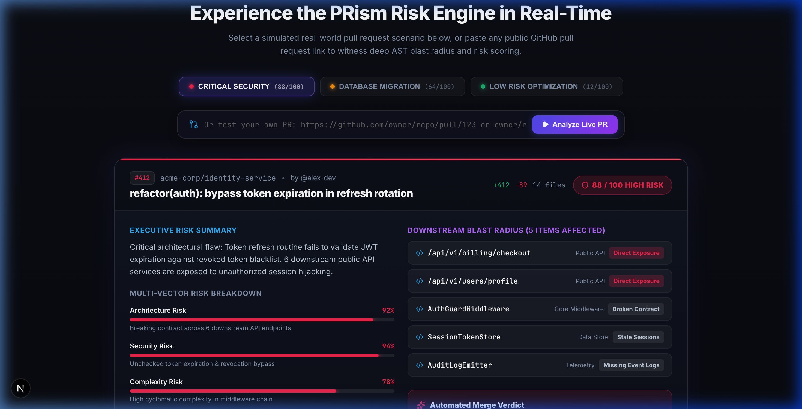
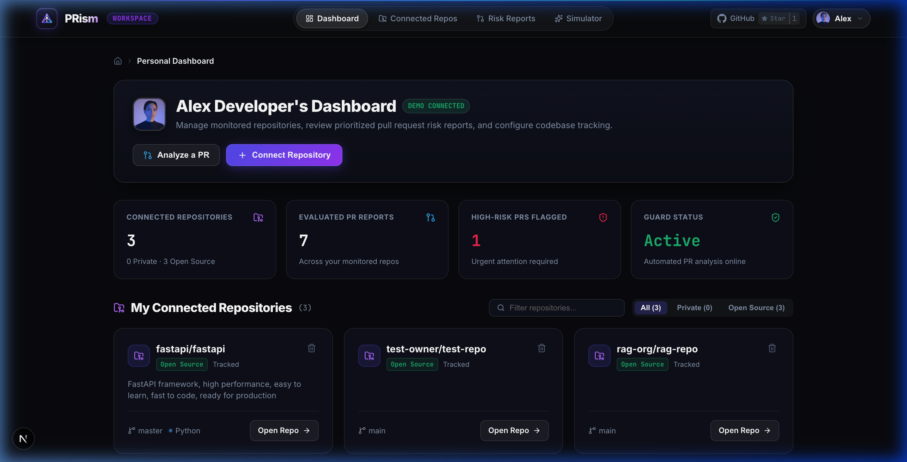
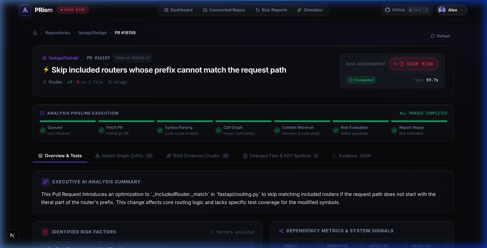
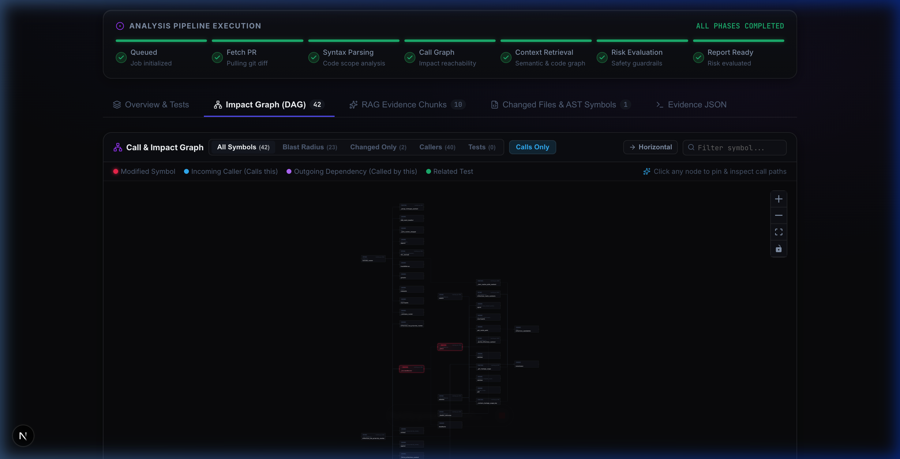
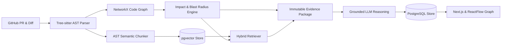

# PRism

> **Autonomous AI Pull Request Risk Analyzer & Downstream Blast Radius Intelligence Engine**

PRism analyzes GitHub Pull Requests using **Tree-sitter AST static analysis**, **directed multi-graph dependency modeling (NetworkX)**, **AST-aware semantic code chunking with pgvector hybrid retrieval**, and **evidence-grounded LLM synthesis** to compute blast radiuses, risk scores, and missing test recommendations before code is merged.

[](https://python.org)
[](https://fastapi.tiangolo.com)
[](https://nextjs.org)
[](https://reactflow.dev)
[](https://github.com/pgvector/pgvector)
[](https://tree-sitter.github.io)
[](https://networkx.org)
[](LICENSE)

---

## Platform Showcase

### 1. Interactive Landing Page & Live PR Risk Simulator
Test public GitHub pull requests instantly or simulate diff impacts before pushing to production:


### 2. Developer Dashboard & Monitored Repositories
Track connected codebases, evaluate pull request risk distributions, and manage guardrails:


### 3. AI Risk Analysis & Evidence Report
Evidence-backed risk classification, affected components, sensitive domain alerts, and automated test plans:


### 4. Interactive Blast Radius Call Graph (DAG)
Interactive visual topology tracking direct callers, transitive dependents, and test coverage using ReactFlow:


---

## Architectural Flow

The diagram below illustrates the end-to-end analysis pipeline:



---

## How It Works (Under the Hood)

### 1. AST-Level Diff Mapping
GitHub unified diff patches are parsed into line-numbered hunks. PRism overlaps these added/modified line sets with **Tree-sitter AST symbol boundaries** (`[start_line, end_line]`). Only functions, classes, and methods whose actual syntax trees were modified are marked as changed symbols.

### 2. Dependency Graph & Blast Radius
A **NetworkX directed graph** (`CodeGraph`) models relationships across files and symbols with typed edges (`CALLS`, `IMPORTS`, `EXTENDS`, `TESTS`). Reverse-edge breadth-first search traverses callers and transitive dependents up to 3 hops deep to quantify downstream blast radius:

$$\text{Dependents}(u) = \{ v \in V \mid \exists \text{ path } v \to u \text{ with depth } \le 3 \}$$

### 3. Deterministic Risk Classification
Before invoking AI, changes are evaluated against structural rules detecting mutations to sensitive boundaries:
- **Public API routes:** `route`, `controller`, `endpoint`, `handler`
- **Database schemas & ORM models:** `migration`, `model`, `schema`, `alembic`
- **Security & Identity:** `auth`, `token`, `jwt`, `oauth`, `permission`
- **Financial impact:** `payment`, `billing`, `stripe`, `invoice`
- **Infrastructure & CI:** `docker`, `kubernetes`, `deploy`, `.yaml`
- **Test Absence Flag:** Triggers automatically if symbols changed without matching test coverage.

### 4. Contextual Hybrid RAG (pgvector)
Code chunks are partitioned along AST symbol boundaries and vectorized with 1536-dimensional embeddings (via Google Gemini or OpenAI). PRism executes a hybrid search combining call-graph neighbors with vector cosine similarity across synthesized PR queries, tagging each retrieved chunk with provenance (`static_graph`, `semantic_search`, or `hybrid`).

### 5. Grounded LLM Reasoning & Fallback
The LLM operates under a strict **Zero-Hallucination Evidence Contract**:
- Must cite specific file paths and symbol names from the static analysis and retrieved chunks.
- Prohibited from inventing dependencies, tests, or database schemas.
- Supports **Google Gemini 2.5 Flash**, **OpenAI GPT-4o-mini**, and **Anthropic Claude 3.5 Haiku**.
- Includes a **Deterministic Fallback Engine** that scores risk based on topological metrics and sensitive flags if external AI APIs are unreachable.

### 6. Interactive Blast Radius Visualization
The Next.js frontend renders an interactive graph powered by **ReactFlow** and **Dagre** hierarchical layout, color-coding root changes (red), direct callers (orange), transitive dependents (yellow), and test coverage (blue).

---

## Authentication & Security

- **Dual OAuth 2.0 Integration:** Supports both GitHub OAuth (read-only repository access) and Google OAuth (OIDC).
- **Stateless Cryptographic Sessions:** HS256-signed JWTs stored in secure, `HttpOnly`, `SameSite=Lax` cookies (`prism_session`) with a 7-day expiration.
- **Resilient Media Referrer Isolation:** Google user profile pictures (`lh3.googleusercontent.com`) are loaded with `referrerPolicy="no-referrer"` to bypass cross-origin CDN referrer blocking, with automatic fallback to monogram initials.
- **Zero Code Retention Guarantee:** Analyses operate ephemerally on scoped commit SHAs. Full repositories are never permanently cloned or stored to disk.

---

## Local Development & Setup

### Prerequisites
- **Python:** 3.12+
- **Node.js:** 20+
- **PostgreSQL:** 16+ with `pgvector` enabled
- **Docker:** Optional (for containerized DB and Redis)

### 1. Clone & Setup Workspace
```bash
git clone https://github.com/manishiitmandi/Prism.git
cd Prism
make install
```

### 2. Configure Environment
```bash
cp .env.example apps/backend/.env
# Update apps/backend/.env with your DATABASE_URL and API keys
```

### 3. Start Database Services (Docker)
```bash
docker compose up -d postgres redis
```

### 4. Run Development Servers
```bash
# Terminal 1: FastAPI Backend (Port 8000)
make dev-backend

# Terminal 2: Next.js Frontend (Port 3000)
make dev-frontend
```

Open [http://localhost:3000](http://localhost:3000) to access the interactive dashboard, simulator, and repository analyzer.

### 5. Run Test Suite
```bash
make test
# or direct backend tests
cd apps/backend && pytest tests/ -v
```
